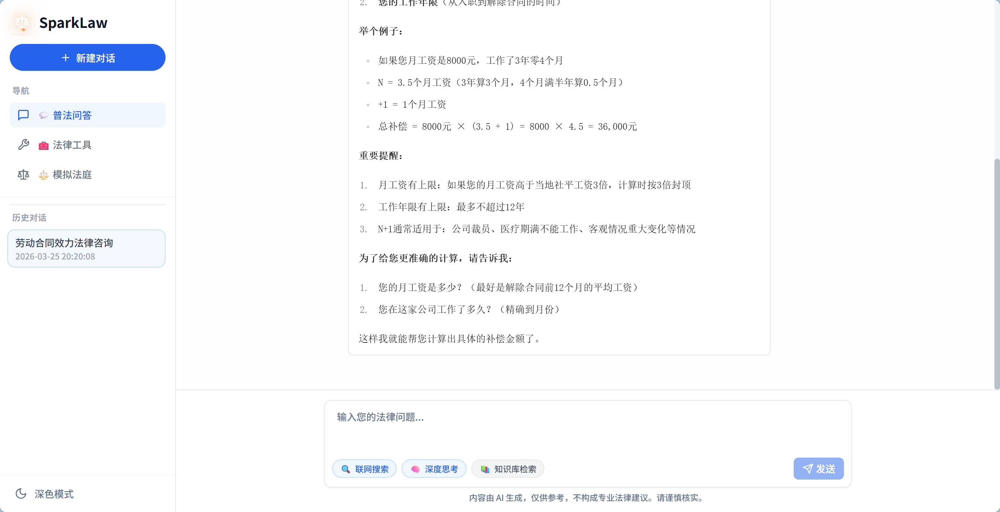
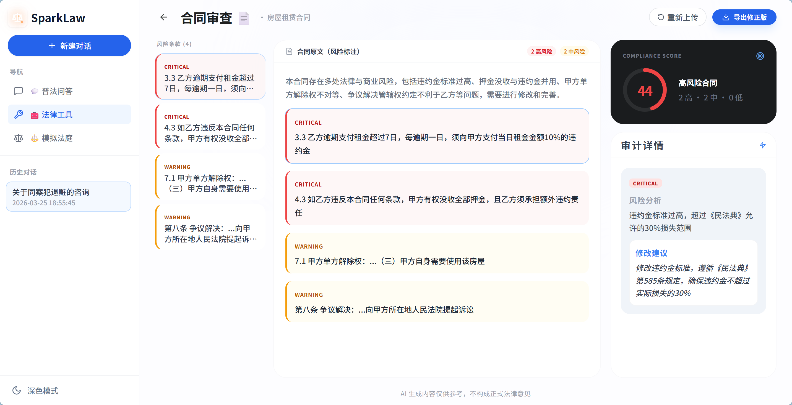
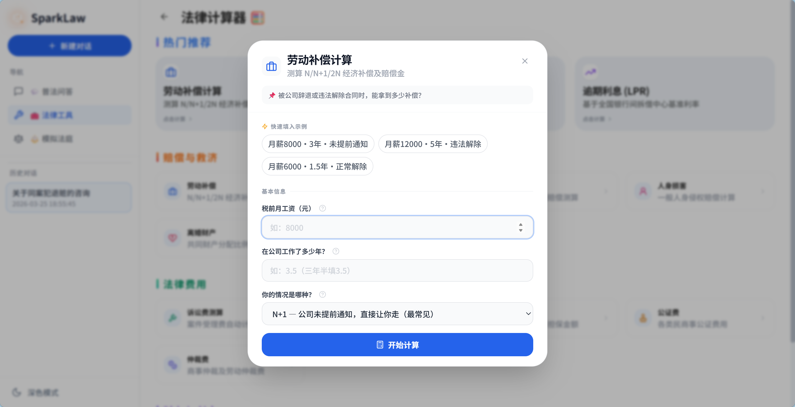
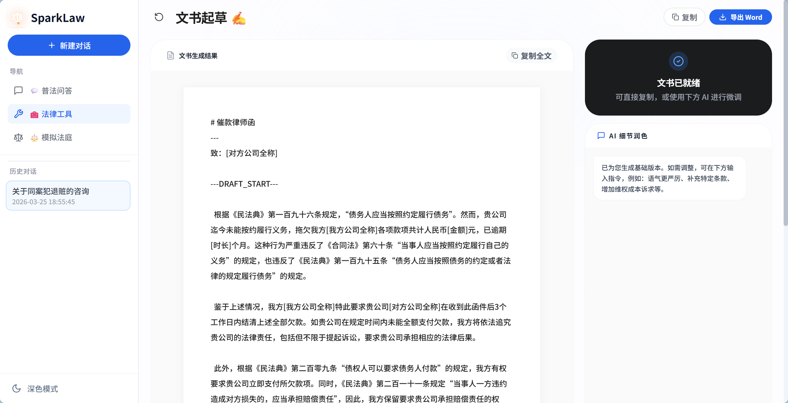
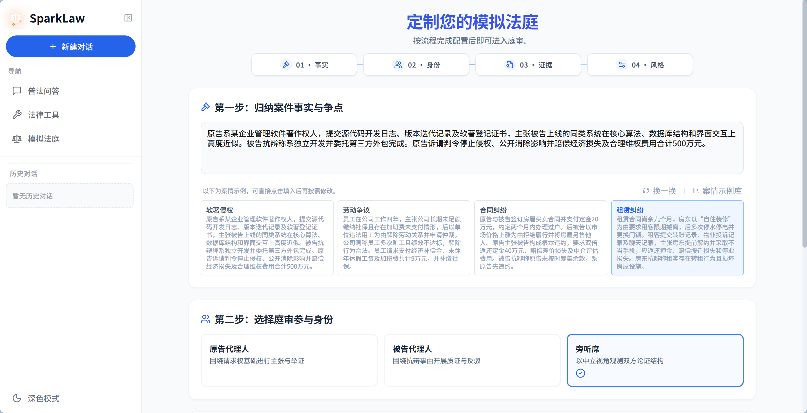
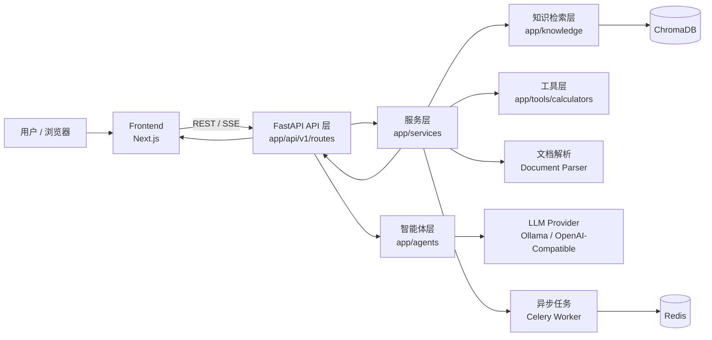

<div align="center">

# SparkLaw ⚖️

### 面向中文法律场景的开源 AI 智能体系统

<p>
  <a href="./LICENSE"></a>
  <a href="https://github.com/QingShengmMa/SparkLaw/pulls"></a>
  <a href="https://github.com/QingShengmMa/SparkLaw/stargazers"></a>
  <a href="https://img.shields.io/badge/FastAPI-Backend-009688?logo=fastapi&logoColor=white"></a>
  <a href="https://img.shields.io/badge/Next.js-Frontend-000000?logo=nextdotjs"></a>
  <a href="https://img.shields.io/badge/Python-3.10%2B-3776AB?logo=python&logoColor=white"></a>
</p>

[English](./README_EN.md) · 中文

<p align="center">
  
</p>

</div>

---

## 📌 项目简介

`SparkLaw` 是一个聚焦中文法律场景的开源 AI 项目，覆盖「问」「用」「演」三大核心场景：  
**问**——随时随地咨询专业法律问题；  
**用**——合同审查、费用计算、文书起草一站直达；  
**演**——多角色 AI 模拟真实庭审对抗，直观感受司法推理全过程。  
项目目标是提供一套**可运行、可扩展、可二次开发**的法律 AI 工程骨架，而不仅是一个演示页面。

---

## 🖼️ 功能预览

### 问 · 普法问答

> 多轮上下文、流式回复、会话记忆，随时随地获得专业法律解答。

<table>
  <tr>
    <td width="50%" valign="top">
      
      <b>问答界面</b>
    </td>
    <td width="50%" valign="top">
      
      <b>问答结果</b>
    </td>
  </tr>
</table>

---

### 用 · 法律工具

> 合同审查、法律计算器、文书起草——高频法律事务，一站直达。

<table>
  <tr>
    <td width="50%" valign="top">
      
      <b>合同审查</b><br />
      自动识别高风险条款并给出可落地的改写建议，帮助你先把合同“体检一遍”。
    </td>
    <td width="50%" valign="top">
      
      <b>合同审查 · 结果详情</b><br />
      风险等级、问题条款与修改建议一屏呈现，方便快速定位和逐条处理。
    </td>
  </tr>
  <tr>
    <td width="50%" valign="top">
      
      <b>法律计算器</b><br />
      覆盖常见法律费用与赔偿场景，输入关键参数即可得到清晰测算结果。
    </td>
    <td width="50%" valign="top">
      
      <b>法律计算器 · 计算展示</b><br />
      结果按项目拆分展示，计算依据透明可追溯，便于沟通与复核。
    </td>
  </tr>
  <tr>
    <td width="50%" valign="top">
      
      <b>文书起草</b><br />
      基于案情自动生成规范文书草稿，支持继续补充事实、法条与诉求。
    </td>
    <td width="50%" valign="top">
      
      <b>文书起草 · 生成结果</b><br />
      输出结构完整、可直接编辑的文书内容，便于二次润色后进入实务流程。
    </td>
  </tr>
</table>

---

### 演 · 模拟法庭

> 多角色 AI 对抗推理，还原真实庭审流程，直观感受司法推演全过程。

<p align="center">
  
</p>

---

## 🧱 技术栈

- **后端**：Python 3.10+、FastAPI、Pydantic、Uvicorn
- **前端**：Next.js 16、React 18、TypeScript、Tailwind CSS、Zustand
- **AI / 智能体编排**：LangChain、LangGraph
- **检索与知识库**：ChromaDB、sentence-transformers
- **异步与任务队列**：Celery、Redis
- **文档处理**：PyMuPDF、python-docx
- **部署与环境**：Docker、docker-compose

---

## 🏗️ 项目架构（关键模块）




```text
SparkLaw/
├─ app/
│  ├─ main.py                          # FastAPI 入口，注册路由与中间件
│  ├─ api/v1/routes/
│  │  ├─ chat.py                       # 法律问答（普通 + SSE）
│  │  ├─ document.py                   # 文档上传、解析、检索
│  │  ├─ tools.py                      # 合同审查、模拟法庭、分析工作流
│  │  └─ legal_tools.py                # 文书起草/证据评估/合规体检/计算器网关
│  ├─ agents/                          # Agent 角色与对话编排
│  ├─ services/                        # 业务核心：审查器、法庭代理、RAG、LLM 工厂
│  ├─ knowledge/                       # 召回、重排、引用与向量存储
│  ├─ tools/calculators/               # 14 类法律计算器策略与工厂调度
│  ├─ core/                            # 配置、日志、记忆管理等基础能力
│  └─ workers/                         # Celery 应用定义
├─ frontend/src/
│  ├─ app/                             # Next.js 路由页面（chat/contract/court/tools...）
│  ├─ components/                      # 业务组件与共享组件
│  ├─ hooks/                           # 自定义 hooks（主题、设置等）
│  └─ store/                           # 前端状态管理
├─ tests/                              # 后端接口与服务测试
├─ eval/                               # 评测数据生成与评估脚本
└─ docker-compose.yml                  # 本地容器化编排
```

### 核心请求链路（简化）

1. 前端页面发起请求（REST / SSE）
2. `api/v1/routes` 进行参数接收与协议转换
3. `services` 触发对应工作流（问答、审查、法庭、工具）
4. `agents + knowledge + tools` 完成推理、检索与计算
5. 结果以结构化 JSON 或流式事件返回前端

---

## 🚀 快速开始

### 前置要求

- Python 3.10+
- Node.js 18+
- （可选）Redis 6+
- （可选）Ollama（本地模型模式）

### 1) 克隆项目

```bash
git clone https://github.com/QingShengmMa/SparkLaw.git
cd SparkLaw
```

### 2) 配置环境变量

```bash
# backend
cp .env.example .env

# frontend
cd frontend
cp .env.local.example .env.local
cd ..
```

### 3) 启动后端

```bash
python -m venv venv
# Windows
venv\Scripts\activate
# macOS / Linux
# source venv/bin/activate

pip install -r requirements.txt
uvicorn app.main:app --reload --host 0.0.0.0 --port 8000
```

### 4) 启动前端

```bash
cd frontend
npm install
npm run dev
```

访问：`http://localhost:3000`

---

## ⚙️ 关键环境变量说明

| 变量名 | 说明 | 示例 |
|---|---|---|
| `LLM_MODE` | 模型模式：`local` / `cloud` | `cloud` |
| `OPENAI_API_KEY` | 云端模型密钥 | `sk-***` |
| `OPENAI_BASE_URL` | OpenAI 兼容网关 | `https://api.openai.com/v1` |
| `OPENAI_MODEL` | 云端模型名称 | `gpt-4o-mini` |
| `OLLAMA_BASE_URL` | 本地 Ollama 地址 | `http://localhost:11434` |
| `OLLAMA_MODEL` | 本地模型名称 | `qwen2.5:7b` |
| `REDIS_URL` | Redis 主连接 | `redis://localhost:6379/0` |
| `NEXT_PUBLIC_API_URL` | 前端后端地址 | `http://localhost:8000` |

完整配置请参考：`.env.example` 与 `frontend/.env.local.example`。

---

## 🤝 贡献指南

欢迎 Issue / PR！

提交前建议：

1. 确保本地测试通过
2. 描述变更动机与方案
3. 如涉及 UI，附关键截图
4. 保持接口向后兼容或清晰说明 breaking change

详细规则见 [`CONTRIBUTING.md`](./CONTRIBUTING.md)。

---

## ⚠️ 免责声明

SparkLaw 旨在提供法律信息处理与辅助分析能力，不构成律师执业意见，不应直接替代专业法律服务。请在关键法律决策前咨询持证律师。

---

## 📄 License

本项目基于 [MIT License](./LICENSE) 开源。

---

## ⭐ Star 趋势

<p align="center">
  <a href="https://www.star-history.com/?repos=QingShengmMa%2FSparkLaw&type=date&legend=top-left">
    <picture>
      <source media="(prefers-color-scheme: dark)" srcset="https://api.star-history.com/image?repos=QingShengmMa/SparkLaw&type=date&theme=dark&legend=top-left" />
      <source media="(prefers-color-scheme: light)" srcset="https://api.star-history.com/image?repos=QingShengmMa/SparkLaw&type=date&legend=top-left" />
      
    </picture>
  </a>
</p>

---

<div align="center">
  <b>如果 SparkLaw 对你有帮助，欢迎点一个 ⭐ Star！</b>
</div>
