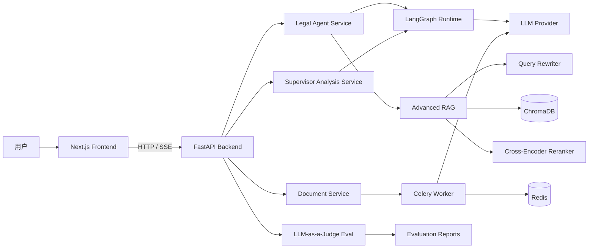
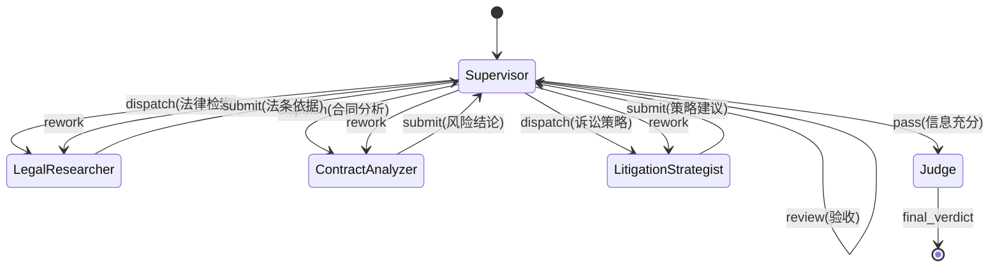

# SparkLaw

> “法自人民来，理为群众讲。”
<p align="left">
  <a href="LICENSE"></a>
  <a href="https://www.python.org/"></a>
  <a href="https://nextjs.org/"></a>
  <a href="https://github.com/langchain-ai/langgraph"></a>
  <a href="https://fastapi.tiangolo.com/"></a>
  <a href="CONTRIBUTING.md"></a>
</p>


---

## 主要功能 (Core Functions)

- **法律问题即时咨询**  
  可以像聊天一样描述你的问题（比如劳动纠纷、租房纠纷、合同违约），系统会给出结构化、可读性强的法律建议。

- **合同风险自动识别**  
  上传合同后，系统会标出可能有风险的条款，并给出“为什么有风险、建议怎么改”的说明，帮助普通用户快速看懂合同。

- **模拟法庭推演**  
  系统会从不同立场（如原告/被告/法官）进行对照分析，帮助你提前看到争议焦点和可能的裁判方向。

- **流式展示分析过程**  
  回答不是一次性“憋出来”的长文本，而是实时输出过程，便于理解系统是如何一步步得到结论的。

- **持续改进的评估体系**  
  项目内置离线评估脚本，持续检查回答质量，让功能迭代更稳定，而不是仅靠主观感受。

---

## 架构设计

### 系统全景图



### Agent 状态机流转图



---

## 快速开始 (Quick Start)

### 前置依赖
- Python 3.10+
- Node.js 18+
- Redis 6+

### 环境配置（`.env` 示例）

```bash
APP_NAME=SparkLaw
APP_VERSION=1.0.0
DEBUG=true

LLM_MODE=cloud
OPENAI_API_KEY=sk-your_api_key_here
OPENAI_BASE_URL=https://api.openai.com/v1
OPENAI_MODEL=gpt-4o-mini

CHROMA_PERSIST_DIR=./data/chroma
REDIS_URL=redis://localhost:6379/0
CELERY_BROKER_URL=redis://localhost:6379/1
CELERY_RESULT_BACKEND=redis://localhost:6379/2
```

### 后端启动

```bash
python -m venv venv
# Windows: venv\Scripts\activate
# macOS/Linux: source venv/bin/activate

pip install -r requirements.txt
cp .env.example .env
uvicorn app.main:app --reload --host 0.0.0.0 --port 8000
```

### 前端启动

```bash
cd frontend
npm install
cp .env.local.example .env.local
npm run dev
```

### Docker（占位）

```bash
docker compose up -d
```

---

## 开发计划 (Roadmap)

### 已完成
- ✅ ReAct Tool Loop（`agent -> tools -> agent`）
- ✅ Supervisor 多智能体编排
- ✅ Advanced RAG（Rewrite + Recall + Rerank）
- ✅ FastAPI + SSE 流式输出
- ✅ Celery 异步审查链路
- ✅ LLM-as-a-Judge 离线评估

### 计划中
- 🔲 BM25 + Dense 混合检索
- 🔲 更多本地开源模型接入
- 🔲 对接真实裁判文书库与引用链
- 🔲 评估指标接入 CI 回归
- 🔲 多租户会话持久化

---

## 贡献 (Contribution)

欢迎提交 Issue / PR，一起把这个项目打磨得更稳、更清晰。  
贡献说明见：[`CONTRIBUTING.md`](CONTRIBUTING.md)

---

## License

MIT
