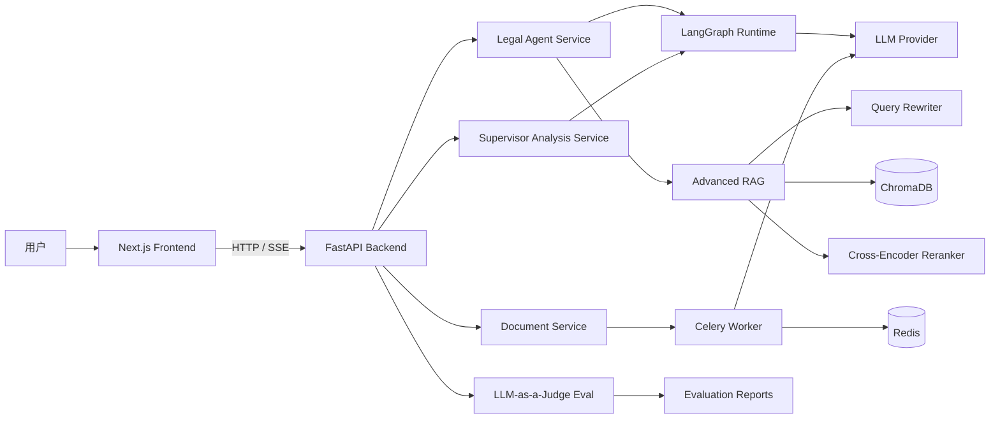
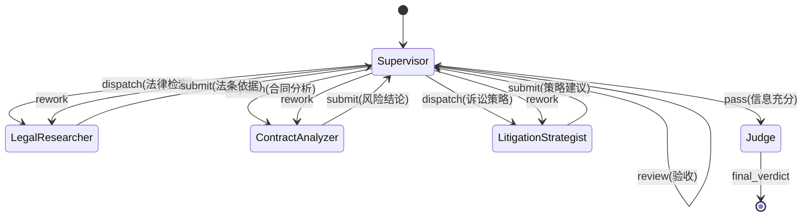

# SparkLaw

> “法自人民来，理为群众讲。”

---

## 主要功能 (Core Functions)

- **Supervisor 多智能体编排（LangGraph）**  
  通过 Supervisor 节点把任务分发给不同 Worker，再进行验收、回流和汇总。当前已支持法律检索、合同分析、策略生成等角色化协作。

- **Advanced RAG 检索链路**  
  检索流程为：`Query Rewrite -> Vector Recall Top-15 -> Cross-Encoder Rerank -> Top-3`。  
  其中 Query Rewrite 用于把口语问题映射为法律语义更明确的检索词，Rerank 用于在候选片段中做精排。

- **FastAPI + SSE 流式输出**  
  后端采用异步接口，前端可实时接收状态事件（如 tool_call、tool_result、final），便于交互体验和链路调试。

- **Celery 异步任务链路**  
  对合同审查等长耗时流程提供任务队列支持，避免阻塞请求线程。

- **离线评估基线（LLM-as-a-Judge）**  
  `eval/` 提供评估集生成与自动评分脚本，输出 Markdown/JSON 报告，便于做版本间对比。

---

## 架构设计

### 系统全景图



### Agent 状态机流转图



---

## 快速开始 (Quick Start)

### 前置依赖
- Python 3.10+
- Node.js 18+
- Redis 6+

### 环境配置（`.env` 示例）

```bash
APP_NAME=SparkLaw
APP_VERSION=1.0.0
DEBUG=true

LLM_MODE=cloud
OPENAI_API_KEY=sk-your_api_key_here
OPENAI_BASE_URL=https://api.openai.com/v1
OPENAI_MODEL=gpt-4o-mini

CHROMA_PERSIST_DIR=./data/chroma
REDIS_URL=redis://localhost:6379/0
CELERY_BROKER_URL=redis://localhost:6379/1
CELERY_RESULT_BACKEND=redis://localhost:6379/2
```

### 后端启动

```bash
python -m venv venv
# Windows: venv\Scripts\activate
# macOS/Linux: source venv/bin/activate

pip install -r requirements.txt
cp .env.example .env
uvicorn app.main:app --reload --host 0.0.0.0 --port 8000
```

### 前端启动

```bash
cd frontend
npm install
cp .env.local.example .env.local
npm run dev
```

### Docker（占位）

```bash
docker compose up -d
```

---

## 开发计划 (Roadmap)

### 已完成
- ✅ ReAct Tool Loop（`agent -> tools -> agent`）
- ✅ Supervisor 多智能体编排
- ✅ Advanced RAG（Rewrite + Recall + Rerank）
- ✅ FastAPI + SSE 流式输出
- ✅ Celery 异步审查链路
- ✅ LLM-as-a-Judge 离线评估

### 计划中
- 🔲 BM25 + Dense 混合检索
- 🔲 更多本地开源模型接入
- 🔲 对接真实裁判文书库与引用链
- 🔲 评估指标接入 CI 回归
- 🔲 多租户会话持久化

---

## 贡献 (Contribution)

欢迎提交 Issue / PR，一起把这个项目打磨得更稳、更清晰。  
贡献说明见：[`CONTRIBUTING.md`](CONTRIBUTING.md)

---

## License

MIT
