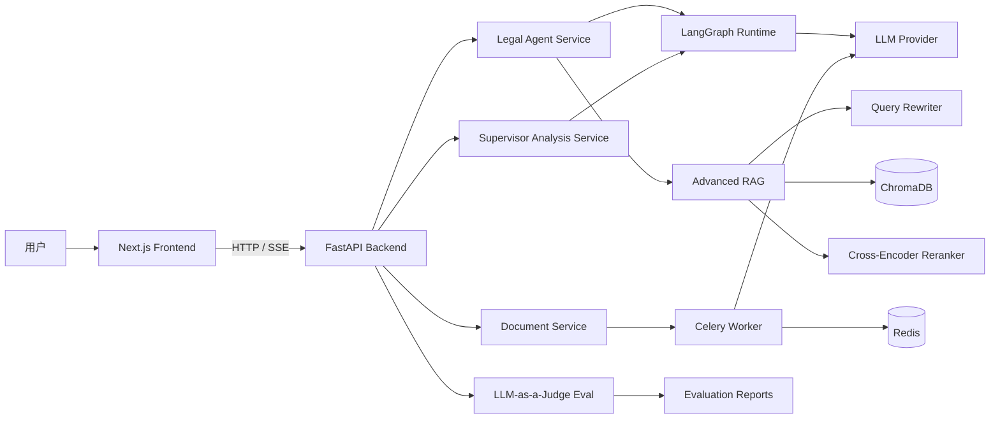
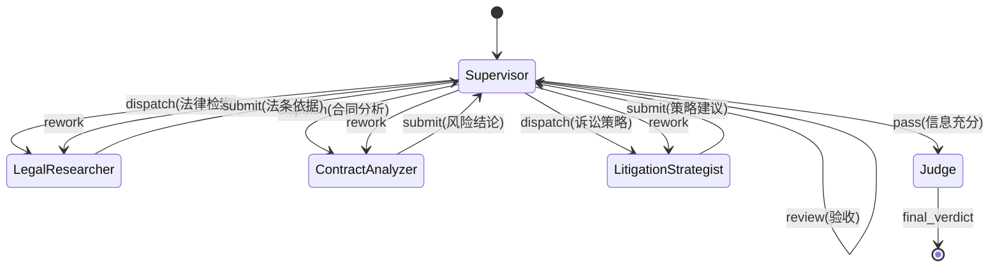

# ⚖️ SparkLaw - 工业级多智能体法律助手

> **法自人民来，理为群众讲；让每一次法律推理都有证据链。**

[](https://www.python.org/)
[](https://www.typescriptlang.org/)
[](https://fastapi.tiangolo.com/)
[](https://nextjs.org/)
[](https://github.com/langchain-ai/langgraph)
[](LICENSE)
[](CONTRIBUTING.md)

**基于 LangGraph 与大模型的全栈法律智能体平台。**

---

## 🧠 模块一：极客门面与精准定位 (The Hook)

SparkLaw 面向真实法律场景构建，核心目标不是“聊天更像人”，而是“推理更像工程系统”。  
它将 **Agent 编排、检索增强、流式交互、离线评估** 放入同一条可演进的技术主干中，适合做法律 AI、Agent 工程、RAG 算法优化的团队级项目底座。

---

## 🚀 模块二：核心特性与“秀肌肉” (Core Features)

- 🧠 **多智能体动态编排（LangGraph Supervisor）**  
  **痛点：** 传统线性链路无法处理“派工-验收-返工”的复杂推理流程。  
  **解法：** 基于 **Supervisor 星型拓扑**，支持原告/被告/法官（或研究员/分析师）动态路由，节点可回流复核，突破单轮推理上限。

- 🔍 **进阶法律检索（Advanced RAG）**  
  **痛点：** 法律长文本场景下，口语 Query 与法条表达鸿沟巨大，容易误召回和幻觉。  
  **解法：** `Query Rewrite -> Recall Top-15 -> Cross-Encoder Rerank -> Top-3`，先扩召回再精重排，显著提升上下文有效密度。

- ⚡️ **极致工程体验（FastAPI Async + SSE）**  
  **痛点：** 大模型“黑箱等待”体验差，链路异常难定位。  
  **解法：** 纯异步后端 + SSE 事件流输出（status/tool_call/tool_result/final），百毫秒级反馈；合同审查链路通过 **Celery** 异步化，避免阻塞 API。

- 📊 **离线量化评估（LLM-as-a-Judge）**  
  **痛点：** 没有评估基线，优化只能“靠感觉”。  
  **解法：** 内置评估集生成与自动评分脚本，产出 Markdown/JSON 报告，支持可复现迭代与回归对比。

---

## 🏗️ 模块三：硬核架构图 (Architecture)

### 1) 系统全景架构图 (System Architecture)



### 2) Agent 状态机流转图 (Agent StateGraph)



---

## ⚙️ 模块四：一键跑通的部署指南 (Quick Start)

### 前置依赖
- Python **3.10+**
- Node.js **18+**
- Redis **6+**

### 环境配置（`.env` 示例）

```bash
APP_NAME=SparkLaw
APP_VERSION=1.0.0
DEBUG=true

LLM_MODE=cloud
OPENAI_API_KEY=sk-your_api_key_here
OPENAI_BASE_URL=https://api.openai.com/v1
OPENAI_MODEL=gpt-4o-mini

CHROMA_PERSIST_DIR=./data/chroma
REDIS_URL=redis://localhost:6379/0
CELERY_BROKER_URL=redis://localhost:6379/1
CELERY_RESULT_BACKEND=redis://localhost:6379/2
```

### 本地启动（Backend）

```bash
python -m venv venv
# Windows: venv\Scripts\activate
# macOS/Linux: source venv/bin/activate

pip install -r requirements.txt
cp .env.example .env
uvicorn app.main:app --reload --host 0.0.0.0 --port 8000
```

### 本地启动（Frontend）

```bash
cd frontend
npm install
cp .env.local.example .env.local
npm run dev
```

### Docker 部署（预留）

```bash
# 企业部署建议入口（可直接作为 CI/CD 目标）
docker compose up -d
```

---

## 🗺️ 模块五：项目演进路线 (Roadmap)

### 已完成（v1.0.0）
- ✅ LangGraph ReAct Tool Loop（agent -> tools -> agent）
- ✅ Supervisor 多智能体动态编排与验收回流
- ✅ Advanced RAG（Query Rewrite + Rerank）
- ✅ FastAPI Async + SSE 流式推演
- ✅ Celery 异步合同审查链路
- ✅ LLM-as-a-Judge 离线评估基线

### 规划中（Next）
- 🔲 BM25 + Dense 混合检索
- 🔲 接入更多开源本地模型（Qwen / GLM / Llama 系）
- 🔲 对接真实裁判文书库与可追溯引用链
- 🔲 评估指标接入 CI 回归门禁
- 🔲 多租户会话持久化（Redis/PostgreSQL）

---

## 🤝 模块六：开源社区与致谢 (Community & Contribution)

- 欢迎提交 Issue / PR，一起把法律 AI 做成真正可落地的工程系统。  
- 贡献指南：[`CONTRIBUTING.md`](CONTRIBUTING.md)
- 交流群占位：``

### Star History

[](https://star-history.com/#QingShengmMa/SparkLaw&Date)

---

## 📜 License

MIT
