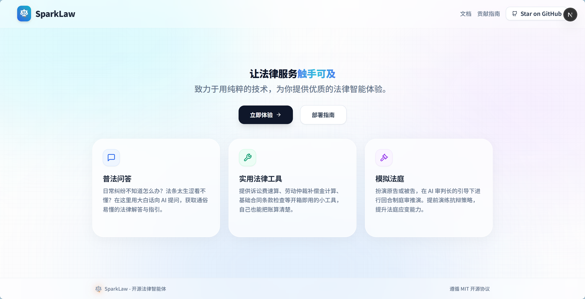
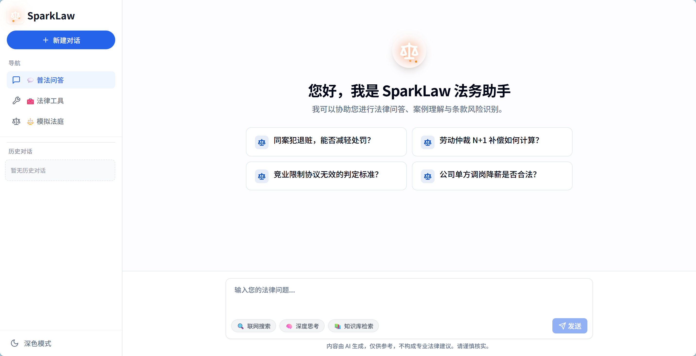
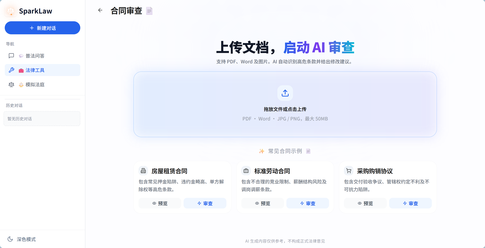
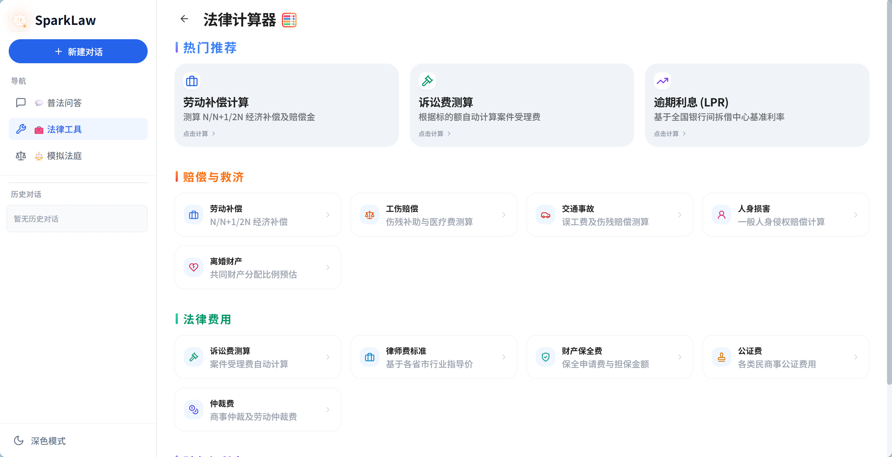
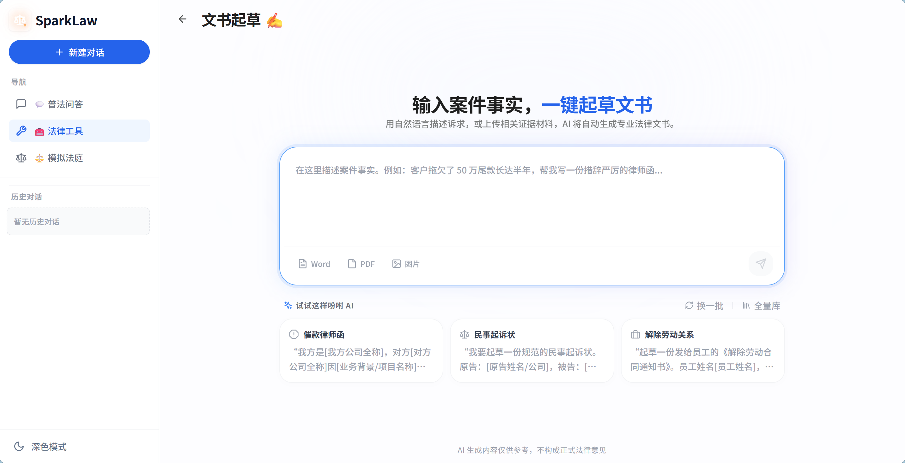
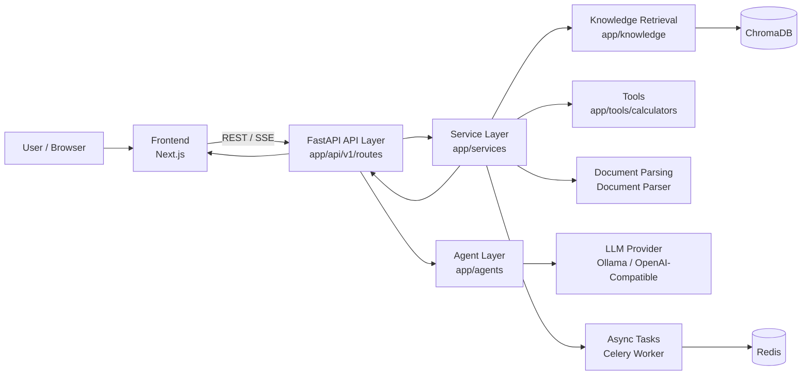

<div align="center">

# SparkLaw ⚖️

### Open-Source AI Agent System for Chinese Legal Scenarios

<p>
  <a href="./LICENSE"></a>
  <a href="https://img.shields.io/badge/FastAPI-Backend-009688?logo=fastapi&logoColor=white"></a>
  <a href="https://img.shields.io/badge/Next.js-Frontend-000000?logo=nextdotjs"></a>
  <a href="https://img.shields.io/badge/Python-3.10%2B-3776AB?logo=python&logoColor=white"></a>
  <a href="https://github.com/QingShengmMa/SparkLaw/pulls"></a>
  <a href="https://github.com/QingShengmMa/SparkLaw/stargazers"></a>
  
</p>

English · [中文](./README.md)

<p align="center">
  
</p>

</div>

---

## 📌 Overview

`SparkLaw` is an open-source AI project focused on Chinese legal scenarios, built around three high-value workflows:

- **Legal Chat**: multi-turn context, streaming responses, and session memory
- **Contract Review**: structured risk detection with revision suggestions
- **Mock Court**: multi-role adversarial reasoning with streaming trial flow

The goal is to provide a **runnable, extensible, and developer-friendly** legal AI engineering foundation—modular backend + standalone frontend, with flexible local/cloud model configuration.

---

## 🖼️ Feature Preview

<table>
  <tr>
    <td width="50%" valign="top">
      
      <b>Legal Chat</b><br />
      Continuous legal consultation with streaming responses across multi-turn conversations.
    </td>
    <td width="50%" valign="top">
      
      <b>Contract Review</b><br />
      Detects contractual risks in a structured way and provides actionable revision suggestions.
    </td>
  </tr>
  <tr>
    <td width="50%" valign="top">
      
      <b>Legal Calculator</b><br />
      Covers common legal fee and compensation scenarios with quick and traceable outputs.
    </td>
    <td width="50%" valign="top">
      
      <b>Document Drafting</b><br />
      Generates standardized legal draft documents from case facts and supports iterative refinement.
    </td>
  </tr>
</table>

---

## 🧱 Tech Stack

- **Backend**: Python 3.10+, FastAPI, Pydantic, Uvicorn
- **Frontend**: Next.js 16, React 18, TypeScript, Tailwind CSS, Zustand
- **AI / Agent Orchestration**: LangChain, LangGraph
- **Retrieval & Knowledge**: ChromaDB, sentence-transformers
- **Async & Queue**: Celery, Redis
- **Document Processing**: PyMuPDF, python-docx
- **Deployment & Runtime**: Docker, docker-compose

---

## 🏗️ Project Architecture (Key Modules)


```mermaid
flowchart LR
    U[User / Browser] --> F[Frontend\nNext.js]
    F -->|REST / SSE| API[FastAPI API Layer\napp/api/v1/routes]

    API --> S[Service Layer\napp/services]
    API --> A[Agent Layer\napp/agents]

    S --> K[Knowledge Retrieval\napp/knowledge]
    S --> T[Tools\napp/tools/calculators]
    S --> P[Document Parsing\nDocument Parser]

    K --> V[(ChromaDB)]
    A --> LLM[LLM Provider\nOllama / OpenAI-Compatible]

    S --> Q[Async Tasks\nCelery Worker]
    Q --> R[(Redis)]

    S --> API
    API --> F
```

```text
SparkLaw/
├─ app/
│  ├─ main.py                          # FastAPI entrypoint: middleware + route registration
│  ├─ api/v1/routes/
│  │  ├─ chat.py                       # Legal Q&A endpoints (standard + SSE)
│  │  ├─ document.py                   # Document upload, parsing, retrieval
│  │  ├─ tools.py                      # Contract review, mock-court, analysis workflows
│  │  └─ legal_tools.py                # Drafting/evidence/compliance/calculator gateway
│  ├─ agents/                          # Agent definitions and dialogue orchestration
│  ├─ services/                        # Core business services: review, court, RAG, LLM factory
│  ├─ knowledge/                       # Retrieval, reranking, citation, and vector store adapters
│  ├─ tools/calculators/               # 14 legal calculator strategies + factory dispatch
│  ├─ core/                            # Shared foundations: config, logging, memory
│  └─ workers/                         # Celery app definitions
├─ frontend/src/
│  ├─ app/                             # Next.js route pages (chat/contract/court/tools...)
│  ├─ components/                      # Domain components + shared UI components
│  ├─ hooks/                           # Custom hooks (theme/settings)
│  └─ store/                           # Frontend state management
├─ tests/                              # Backend API and service-level tests
├─ eval/                               # Evaluation dataset + scripts
├─ docker-compose.yml                  # Standard Docker stack: backend + frontend + Redis + Qdrant
└─ docker-compose.lite.yml             # Lightweight Docker stack for small 2C/2G servers
```

### Core Request Flow (Simplified)

1. Frontend pages send REST/SSE requests
2. `api/v1/routes` handles input schema and protocol adaptation
3. `services` triggers the target workflow (chat/review/court/tools)
4. `agents + knowledge + tools` perform reasoning, retrieval, and calculations
5. Results return as structured JSON or streaming events

---

## 🚀 Quick Start

Three startup options are available: manual local development, standard Docker, and lightweight Docker. Use manual local setup for development; use Docker for server deployment.

---

### Option 1: Manual Local Setup (Recommended for Development)

**Prerequisites:** Python 3.10+, Node.js 18+, optional Redis 6+, optional Qdrant, optional Ollama

#### 1. Clone the repository

```bash
git clone https://github.com/QingShengmMa/SparkLaw.git
cd SparkLaw
```

#### 2. Configure environment variables

```bash
# Backend
cp .env.example .env

# Frontend
cd frontend
cp .env.local.example .env.local
cd ..
```

Open `.env` and configure at least one available cloud model key, such as `GROQ_API_KEY`, `DEEPSEEK_API_KEY`, or `OPENAI_API_KEY`. The default provider order is `groq,deepseek`; SparkLaw automatically falls back from Groq to DeepSeek when needed. OpenAI-compatible settings are used when Groq/DeepSeek are not configured.

| Variable | Description | Default |
|----------|-------------|---------|
| `LLM_MODE` | `cloud` (OpenAI-compatible) or `local` (Ollama) | `cloud` |
| `LLM_PROVIDER_ORDER` | Cloud provider order | `groq,deepseek` |
| `GROQ_API_KEY` | Groq API key | — |
| `DEEPSEEK_API_KEY` | DeepSeek API key | — |
| `OPENAI_API_KEY` | OpenAI or compatible API key | — |
| `OPENAI_BASE_URL` | OpenAI-compatible API endpoint | `https://api.openai.com/v1` |
| `OLLAMA_BASE_URL` | Local Ollama address (local mode) | `http://localhost:11434` |
| `ENABLE_SEMANTIC_MEMORY` | Enable semantic memory / embedding model | `true` |
| `ENABLE_SEMANTIC_CACHE` | Enable semantic cache | `true` |
| `SEMANTIC_CACHE_THRESHOLD` | Cache similarity threshold (0-1) | `0.92` |
| `SEMANTIC_CACHE_TTL_DAYS` | Cache TTL in days | `30` |

#### 3. Start the backend

```bash
python -m venv venv

# Windows
venv\Scripts\activate

# macOS / Linux
# source venv/bin/activate

pip install -r requirements.txt
uvicorn app.main:app --reload --host 0.0.0.0 --port 8000
```

#### 4. Start the frontend

Open another terminal:

```bash
cd frontend
npm install
npm run dev
```

Open: `http://localhost:3000`

---

### Option 2: Docker One-Command Startup (Standard Deployment)

**Prerequisites:** Install [Docker Desktop](https://www.docker.com/products/docker-desktop/) (includes Docker Compose).

The standard stack starts frontend, backend, Redis, and Qdrant. It is suitable for full local evaluation or servers with enough memory.

```bash
# First copy and edit the environment file
cp .env.example .env
# Fill in at least one of GROQ_API_KEY, DEEPSEEK_API_KEY, or OPENAI_API_KEY

# First build and start
docker compose up -d --build

# Daily startup
docker compose up -d

# Check status
docker compose ps

# Follow logs
docker compose logs -f

# Stop
docker compose down
```

If your network intermittently fails to pull manifests/layers (e.g. `content size of zero`), pre-pull fixed image tags once:

```bash
docker pull redis:7.4.2-alpine
docker pull qdrant/qdrant:v1.7.4
docker pull node:20.18.3-bookworm-slim
docker compose up -d --build
```

First build takes 3–8 minutes depending on network speed. Subsequent restarts are near-instant.

#### 4. Access the app

| Service | URL |
|---------|-----|
| 🌐 Frontend | http://localhost:3000 |
| ⚙️ Backend API | http://localhost:8000 |
| 📖 API Docs | http://localhost:8000/docs |
| 🧠 Qdrant | http://localhost:6333 |

---

### Option 3: Lightweight Docker Startup (Recommended for Small Servers)

The lightweight stack uses `requirements-lite.txt`, disables observability, semantic memory, and semantic cache by default, and starts only frontend + backend. It is intended for 2C/2G small servers.

```bash
cp .env.example .env
# Fill in at least one of GROQ_API_KEY, DEEPSEEK_API_KEY, or OPENAI_API_KEY

# First build and start the lightweight stack
docker compose -f docker-compose.lite.yml up -d --build

# Daily startup
docker compose -f docker-compose.lite.yml up -d

# Follow logs
docker compose -f docker-compose.lite.yml logs -f

# Stop
docker compose -f docker-compose.lite.yml down
```

Open: `http://localhost:3000`

---

## 🤝 Contributing

Issues and PRs are welcome!

Before submitting:

1. Ensure local tests pass
2. Explain motivation and implementation approach
3. Include screenshots for UI changes
4. Keep API compatibility or clearly document breaking changes

See [`CONTRIBUTING.md`](./CONTRIBUTING.md) for details.

---

## ⚠️ Disclaimer

SparkLaw is designed for legal information processing and AI-assisted analysis. It does not constitute legal advice and should not replace professional legal services. Please consult a licensed attorney before making critical legal decisions.

---

## 📄 License

Released under the [MIT License](./LICENSE).

---

<div align="center">
  <b>If SparkLaw helps you, please consider giving it a ⭐ Star!</b>
</div>
